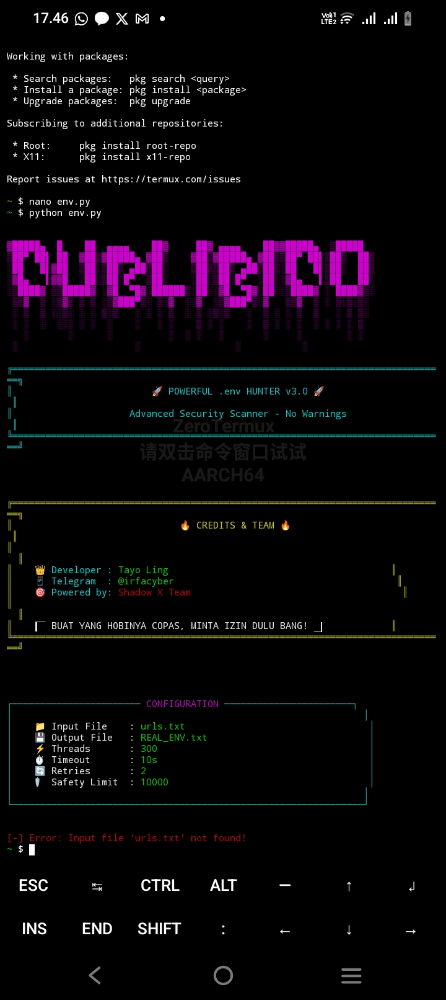

EnvHunter 🔍
Advanced .env File Scanner for Security Research



🌐 Languages
English | Indonesian

```English```
 
🚀 Overview
EnvHunter is a powerful, multi-threaded Python scanner designed to discover exposed .env files on web servers. These files often contain sensitive information like database credentials, API keys, and application secrets.

✨ Features
⚡ High Performance - 300+ concurrent threads

🎯 Smart Detection - Advanced scoring algorithm

🛡️ False Positive Reduction - Comprehensive validation

🔍 Sensitive Data Extraction - Automatic data extraction

🕵️ Stealth Mode - Proxy support & random User-Agents

📊 Real-time Monitoring - Live progress tracking

💾 Multiple Outputs - JSON, text, structured data

📦 Installation
bash
git clone https://github.com/irfa448/.env-scen
cd .env-scen
pip3 install requests colorama
🛠️ Quick Start
Add targets to urls.txt:

bash
echo "https://example.com" >> urls.txt
echo "https://test.site" >> urls.txt
Run scanner:

bash
python3 env.py
Check results:

REAL_ENV.txt - Found .env URLs

FULL_ENV.txt - Full file contents

SENSITIVE_DATA.json - Extracted secrets

⚙️ Configuration
Edit these in the script:

python
INPUT_FILE = "urls.txt"    # Target URLs
OUTPUT_FILE = "results.txt" # Output file  
THREADS = 300              # Concurrent threads
TIMEOUT = 10               # Request timeout

[<video src="https://github.com/irfa448/.env-scen/issues/1#issue-3676653224" controls width="400"></video>](https://github.com/irfa448/.env-scen/issues/1#issue-3676653224)
